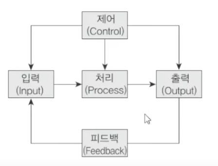

# 1과목 - 소프트웨어 설계

## 소프트웨어

#### 소프트웨어의 특징
- 상품성 : 살사람이 있는 상품
- 복잡성 : 다양한 내용이 있음
- 변경 가능성 : 업그레이드 오류고치기등
- 복제성 : 복제가 용이, 유통가능

#### 시스템의 기본요소
- 입력
- 처리
- 출력
- 제어
- 피드백
    

#### 소프트웨어 위기
- 하드웨어 비용을 초과하는 개발 비용의 증가(개발 인력의 증가 - 인건비 상승)
- 개발 기간의 지연
- 개발 인력 부족 및 인건비 상승
- 성능 및 신뢰성 부족
- 유지보수의 어려움에 따른 엄청난 비용

### 소프트웨어 공학

#### 소프트웨어 공학의 기본 원칙
- 현대적인 프로그래밍 기술을 적용해야 한다
- 신뢰성이 높아야 한다
- 사용의 편리성과 유지보수성이 높아야 한다
- 지속적인 검증을 시행해야 한다

## 재공학

### 재공학

#### 재공학의 장점, 목표, 과정
- 장점
    - 개발시간, 비용 감소
    - 품질 향상
    - 생산성 향상
    - 신뢰성 향상
    - 프로젝트 실패 위험 감소
- 목표
    - 소프트웨어 유지보수성 향상
    - 재사용의 수월, 소프트웨어 수명을 연장
- 과정
    - 분석 -> 구성 -> 역공학 -> 이식    

### 역공학

#### 역공학의 개념
- 소프트웨어를 분석하여 재문서화

### CASE

#### CASE
- 소프트웨어 엔지니어링을 도와주는 자동화 도구

#### CASE가 제공하는 기능
- 개발을 신속 정확하게
- 소프트웨어 품질의 향상
- 소프트웨어 생명주기 전체단계 연결하고 자동화
- 소프트웨어 시스템 문서화 및 명세화를 위한 그래픽 기능 제공
- 소프트웨어 개발 단계의 표준화

#### CASE 사용의 장점
- 개발 기간 단축 및 개발 비용을 절약(생산성 향상)

#### CASE의 분류
- 상위(Upper)CASE - 요구상항 분석 및 설계 단계
- 하위(Lower)CASE - 소스 코드 작성, 테스트, 문서화 과정
- 통합(intergate)CASE - 소프트웨어 개발 주기 전체 과정

#### 요구사항 분석을 위한 CASE도구
- SADT 
    - 소프트웨어 개발을 돕는 하나의 프로그램
    - 블록 다이어그램을 지원한다

## 소프트웨어 개발 방법론

### 소프트웨어 설계 방법론

#### 소프트웨어 생명주기
- 타당성 검토 -> 개발 계획 -> 요구사항 분석 -> 설계 -> 구현 -> 테스트 -> 운용 -> 유지보수

`보헴형이 만든거`
#### 폭포수 모형
- 고전적
- 순차적
- 진행시 수정불가능

#### 나선형 모형
- 반복적
- 위험 분석 
- 개발 및 검증 - 프로토타입(시제품)생성

#### 하향식/상향식 설계
- 하향식 - 상위 함수를 만들고 곁가지로 하나씩 만들기
- 상향식 - 단순한거 부터 만들고 그것들을 통합

#### 프로토타입 모형
- 고객과의 커뮤니케이션이 원활

#### HIPO
- 계층적 입력 처리 출력
- 폭포수와 비슷
- `가시적 도표`, 총체적 다이어그램, 세부적 다이어그램
- `하향식` 소프트웨어 개발을 위한 문서화 도구
- 유지보수가 쉬움

#### V - 모델
- 폭포수모형에 시스템 검증과 테스트 작업을 강조
- HIPO에 테스트를 추가했구나

- 21분 35초